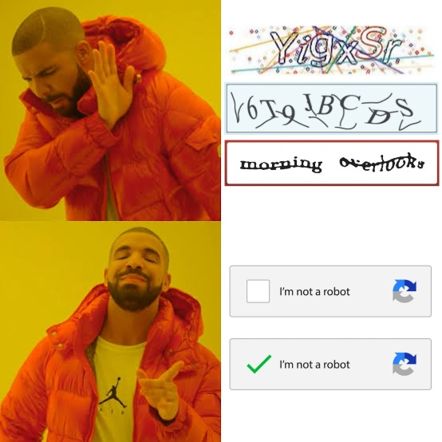
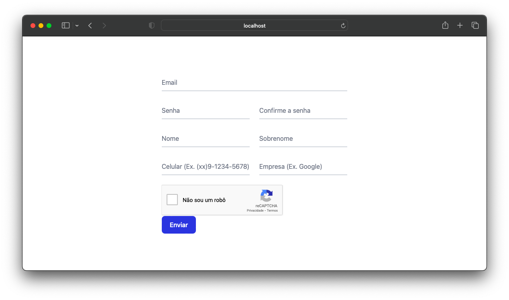

# recaptcha-form

<div align="center">
  
</div>


## 🚀 Projeto
Distinguir usuários humanos de bots automáticos em um site.</br></br>
Status: 🚧 Em construção 🚧

<div align="center">
  
</div>
</br>


## 🛠️ Tecnologias
- [Google reCAPTCHA](https://www.google.com/recaptcha/about/)


## 🗂️ Utilização

### 🐑🐑 Clonando o repositório:

```bash
  $ git clone url-do-projeto.git
```

### ▶️ Rodando o App:

```bash
  $ cd recaptcha-form   #change to that directory 
  $ npm install         #download dependencies to node_modules
  $ npm run dev         #start the project
```
Ver o projeto rodando em: [http://localhost:5173](http://localhost:5173)


## 📋 TODO:
- Habilitar botão "Enviar" somente após verificar recaptcha token no backend ([veja mais](https://blog.logrocket.com/implement-recaptcha-react-application/))


## ⭐ Like, Subscribe, Follow!
Curtiu o projeto? Marque esse repositório com uma Estrela ⭐!